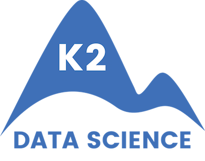

# K2 Core Curriculum

This repository contains Kevin Chow's assignments for the [K2 Data Science Bootcamp](http://www.k2datascience.com/).

# Table of Contents:

[1. Unit 7 - Statistical Inference](#section-a)  
[2. Unit 8 - Exploratory Data Analysis](#section-a)

---

## <a name="section-a">Unit 7</a>
[Titanic_Exercises.ipynb](https://github.com/kevinchowder/k2_assignments/blob/master/Titanic_Exercises.ipynb)

## <a name="section-a">Unit 8</a>
[EDA_Movies_Exercises.ipynb](https://github.com/kevinchowder/k2_assignments/blob/master/EDA_Movies_Exercises.ipynb) 
[EDA_Olympics_Exercises.ipynb](https://github.com/kevinchowder/k2_assignments/blob/master/EDA_Olympics_Exercises.ipynb) 
[Subway Canvassing Project](https://github.com/kevinchowder/NYCSubwayCanvas)
